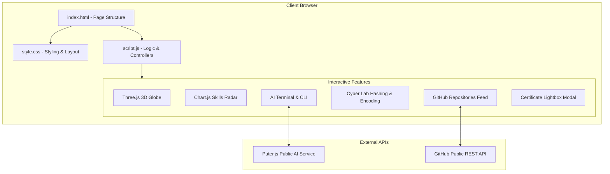

# Kuldeep Shukla

Cybersecurity operations and engineering portfolio built for modern web browsers. The project is organized into three clean, well-structured files: HTML for structure, CSS for design, and JavaScript for functionality.

---

## 1. Project File Structure

The project follows a standard three-file web structure:

```
kuldeepshukla01.github.io/
├── index.html              # Main HTML page structure and semantic elements
├── style.css               # All styling, layout, theme colors, and responsiveness
├── script.js               # All JavaScript logic, animations, and API integrations
├── Kuldeep_Shukla_CV.pdf   # Verified CV download
├── favicon.ico             # Clean transparent favicon (no logo)
└── assets/
    └── cyber_assets/       # Project screenshots, institution crests, and certificates
        ├── certs/          # High-resolution certificates (EC-Council, Cisco, CodeRed)
        └── ...
```

### File Responsibilities:
- **`index.html`**: Contains the page skeleton, section tags, text descriptions, and links to external CDNs, `style.css`, and `script.js`.
- **`style.css`**: Contains all CSS rules, dark theme variables, flexbox/grid layouts, card styling, and media queries for mobile devices.
- **`script.js`**: Contains all browser logic, including the Three.js 3D Earth globe, Chart.js skills radar chart, Puter.js AI terminal, client-side crypto tools, GitHub repository fetching, and the certificate modal.

---

## 2. System Architecture

The portfolio runs entirely in the client's web browser without needing a custom backend server. It connects to public APIs directly from JavaScript:



---

## 3. Core Sections & Features

### 1. Page Loading Screen (Preloader)
- Shows a clean progress bar while page assets load.
- Automatically transitions into the main portfolio view after initialization.

### 2. Top Navigation Bar
- Slim, full-width fixed header.
- Text-only title displaying **KULDEEP SHUKLA** without logos or icons.
- Responsive mobile drawer menu for smaller screens.

### 3. About Me & Interactive Terminal
- **Profile Card**: Displays candidate details, education (BSc Hons Computing & IT graduate from CCT College Dublin), and verified roles (Junior Pentester, SOC Analyst, ML Defense Researcher).
- **Interactive Terminal**:
  - Allows visitors to type classic commands like `help`, `skills`, `projects`, `certs`, `about`, `repos`, and `clear`.
  - Integrates Puter.js AI chat (`ai <question>`) so recruiters can ask freeform questions about Kuldeep's background.
  - Includes an offline keyword matching fallback if external connectivity is unavailable.

### 4. Projects (Arsenal Grid)
Showcases four genuine technical projects:
1. **1DayCrew AI**: Machine Learning Network Intrusion Detection System (NIDS) classifying 14 cyber attack types with >97% precision on the benchmark CICIDS2017 dataset. Built with Python and XGBoost.
2. **KD-Teliport-**: Python-based autonomous agent executing endpoint reconnaissance, service fingerprinting, and automated vulnerability correlation.
3. **ai-check-**: Python threat validation tool screening AI outputs against adversarial prompt injections and data leaks.
4. **Offensive CTF War-Games Range**: Hands-on problem-solving in live offensive labs including the EC-Council Hackerverse CTF, TryHackMe, and Hack This Site.

### 5. Verified Industry Certifications
Displays real, verified certificates with an interactive full-size modal window:
- **EC-Council Hackerverse CTF Competition (DFIR)**: Grandmaster Rank, Cert #2126 (04 Oct 2026).
- **Cisco Networking Academy — Ethical Hacker**: Comprehensive pentesting course (26 Jan 2026).
- **Cisco Networking Academy — Certificate of Completion**: Course competencies verification (26 Jan 2026).
- **EC-Council — Deep Web and Cybersecurity**: Darknet and threat intelligence (04 Feb 2024).
- **EC-Council CodeRed — Android Bug Bounty Hunting**: Mobile penetration testing (04 Jun 2026).
- **EC-Council CodeRed — Jira Agile Project Management**: DevSecOps and vulnerability workflows (21 Aug 2026).

### 6. Live Cyber Lab Tools
Working client-side security utilities running directly in browser memory:
- **Hash Calculator**: Uses the standard W3C Web Crypto API (`window.crypto.subtle`) for SHA-256, SHA-512, and SHA-1 hashing.
- **Data Encoders**: Converts text to Base64, URL encoding, and Hexadecimal.
- **Password Strength & Entropy Scorer**: Evaluates character pool combinations and calculates password entropy in bits.
- **System Information Scanner**: Inspects local client environment properties (browser, screen resolution, CPU cores).

### 7. Skills Matrix & 3D Earth Globe
- **Skills Radar Chart**: Built with Chart.js to visually compare competencies across Penetration Testing, Network Security, ML Defense, Android Security, Vulnerability Assessment, and Reverse Engineering.
- **Interactive 3D Earth Globe**: Built with Three.js WebGL. Displays coordinate points with a highlighted marker on Dublin, Ireland. Supports interactive drag-to-rotate.

### 8. Education & Experience Timeline
- Chronological timeline featuring milestones:
  - 2026: EC-Council Hackerverse CTF Grandmaster.
  - 2026: Cisco Ethical Hacker Certification.
  - 2026: BSc (Hons) Computing & IT Completion, CCT College Dublin.
  - 2024: EC-Council Deep Web & CTI Certification.
  - 2022: Enrolled in BSc Computing & IT at CCT College Dublin.
  - 2020: Diploma in Information Technology, Hewett Polytechnic.

### 9. GitHub Repositories Live Feed
- Automatically pulls repository information from `https://api.github.com/users/kuldeepshukla01/repos`.
- Filters repositories by language (`All`, `Python`, `Jupyter Notebook`, `JavaScript`, `Java`).
- Displays live star counts, fork counts, and update dates.

---

## 4. Technologies Used

| Technology | Purpose |
|---|---|
| **HTML5** | Semantic structure and content organization |
| **CSS3** | Layout (Grid & Flexbox), styling, animations, and media queries |
| **Vanilla JavaScript (ES6+)** | Application logic, DOM events, and tool calculations |
| **Three.js (r128 CDN)** | 3D WebGL Earth globe rendering and user rotation |
| **Chart.js (v4 CDN)** | Interactive radar chart for technical competencies |
| **Puter.js (v2 CDN)** | Public browser-based AI chat for the virtual terminal |
| **Web Crypto API** | Native hardware-accelerated cryptographic hash functions |
| **FontAwesome 6.5** | Standard vector icons for tools and links |

---

## 5. Running the Project Locally

No complex build step or framework installation is required. You can run the project using any standard HTTP server:

```bash
# 1. Clone the repository
git clone https://github.com/kuldeepshukla01/kuldeepshukla01.github.io.git

# 2. Go to the project directory
cd kuldeepshukla01.github.io

# 3. Start a local server with Python 3
python3 -m http.server 3000

# 4. Open in your browser
# Navigate to: http://localhost:3000
```

You can also double-click `index.html` to open it directly in modern browsers.

---

## 6. GitHub Pages Deployment

The repository is configured for automatic deployment through GitHub Pages:
- Any commits pushed to the `main` branch are served live at:
  ```
  https://kuldeepshukla01.github.io
  ```

---

## 7. Author Information

- **Name**: Kuldeep Shukla
- **Target Roles**: Junior Penetration Tester / SOC Analyst / Security Engineer
- **Education**: BSc (Hons) Computing & IT, CCT College Dublin
- **Location**: Dublin, Ireland
- **LinkedIn**: [linkedin.com/in/1daycrew](https://www.linkedin.com/in/1daycrew)
- **GitHub**: [github.com/kuldeepshukla01](https://github.com/kuldeepshukla01)
